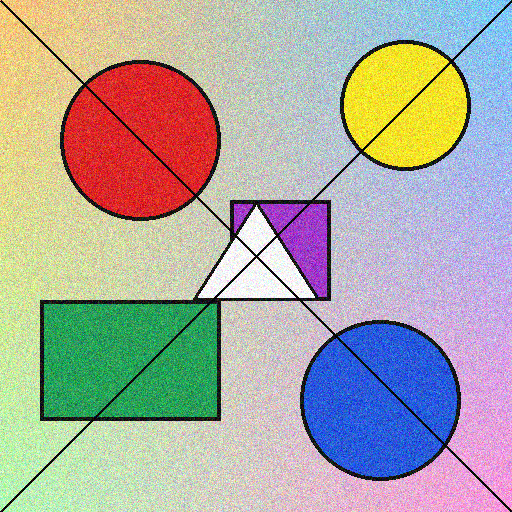
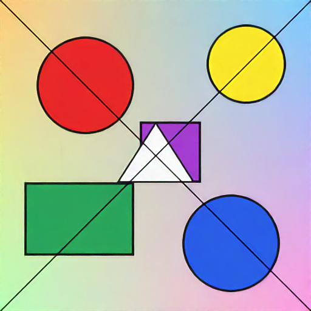
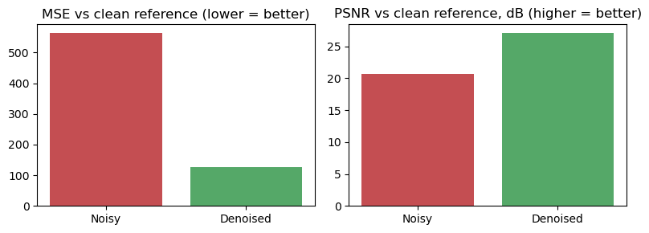
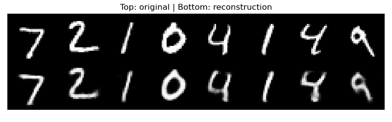
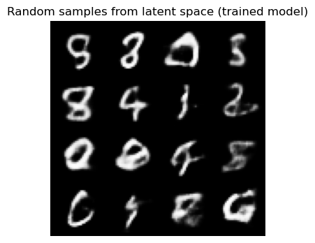
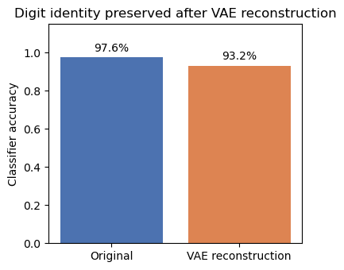
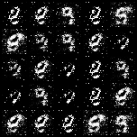
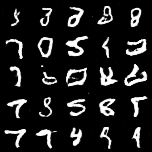
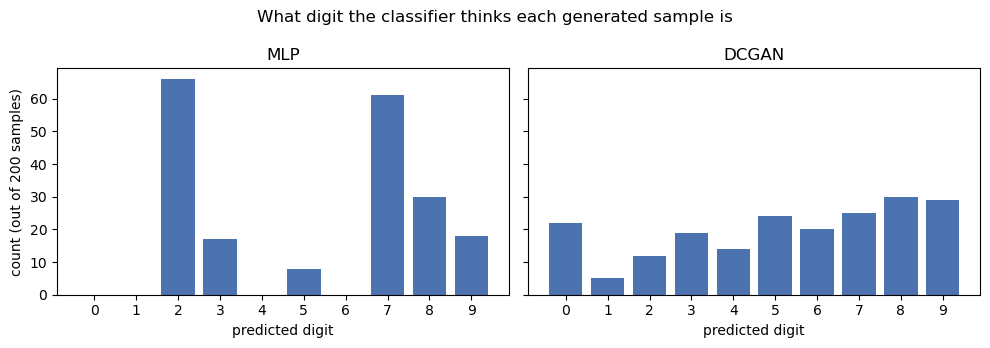

# PIXEL AI — Image Restoration & Generative AI Lab

**Author:** Udbhav Narawat

A small classroom project exploring three different approaches to "AI + images":
denoising with a pretrained filter (OIDN), reconstruction/generation with a
Variational Autoencoder (VAE), and pure generation with a GAN. All three are
kept as separate, independent modules — they solve different problems and
aren't meant to be combined into one network — with a single Streamlit app
tying them together.

## For the evaluator

Fastest way to check this without installing anything: scroll to **Results**
below — every module's actual output is embedded there directly, including
a GAN vs. DCGAN comparison showing a real debugging/improvement process, not
just a single result.

To run it live instead:
```bash
pip install -r requirements.txt
streamlit run app/streamlit_app.py
```
All three tabs (OIDN / VAE / GAN) work immediately — every checkpoint is
already trained and committed to this repo, nothing needs to be trained
first.

## Project overview

- **OIDN** — takes a noisy image, removes the noise. Pretrained, no training
  involved on our end.
- **VAE** — learns to encode MNIST digits into a compact latent space and
  decode them back; can reconstruct a digit or generate a new one from a
  random point in that latent space.
- **GAN** — learns to generate new MNIST digits from random noise, by
  training a generator against a discriminator.

These solve genuinely different problems and shouldn't be confused for one
another: OIDN restores an existing image, the VAE gives you a structured
latent space plus reconstruction/generation, and the GAN only generates from
noise with no input image at all.

## Architecture

**OIDN:**
```
Noisy Image → OIDN → Clean Image
```

**VAE:**
```
Image → Encoder → (mu, logvar) → Reparameterize → z → Decoder → Reconstruction
```

**GAN:**
```
Noise → Generator → Fake Image
                        ↑
        Discriminator ←-┘  (also sees real images)
```

## Project structure

```
PIXEL-AI/
├── app/streamlit_app.py     Streamlit frontend, ties all three modules together
├── oidn/                    OIDN inference (pretrained, no training script)
├── vae/                     VAE model, dataset, train, inference
├── gan/                     GAN model, dataset, train, inference
├── notebooks/                01_OIDN.ipynb, 02_VAE.ipynb, 03_GAN.ipynb, eval_utils.py (shared evaluation classifier)
├── models/                   saved checkpoints (oidn/ has none — see its README; eval_classifier.pt is evaluation-only, not a project module)
├── results/                   saved plots and sample images from training
└── data/                       downloaded datasets (MNIST etc., gitignored)
```

Each module folder (`oidn/`, `vae/`, `gan/`) has its own README with the
concepts, architecture, and commands specific to that module.

## Installation

```bash
python -m venv .venv
```

Windows:
```bash
.venv\Scripts\activate
```

Then:
```bash
pip install -r requirements.txt
```

## Running the app

```bash
streamlit run app/streamlit_app.py
```

The OIDN tab works immediately (no training needed). The VAE and GAN tabs
need a trained checkpoint first — see Training below. If a checkpoint is
missing, the app tells you so rather than training silently in the
background.

## Training

```bash
python vae/train.py --epochs 15
python gan/train.py --epochs 30                        # MLP GAN (basic)
python gan/train.py --architecture dcgan --epochs 25    # DCGAN (conv, sharper/more varied — see gan/README.md)
```

Both scripts run on CPU or GPU automatically (`cuda` if available, else
`cpu`) and expose `--epochs`, `--batch-size`, `--lr`, and `--latent-dim`,
among other flags — see each module's README for the full list. A quick
smoke test (`--epochs 1 --max-batches 5`) is useful for checking everything
runs before committing to a full training run.

## Results

All images below are produced by actually running the project's notebooks
(`notebooks/01_OIDN.ipynb`, `02_VAE.ipynb`, `03_GAN.ipynb`) against the real
trained checkpoints — not hand-picked or externally generated images.
Re-running any notebook regenerates the exact same files.

**Proof, not just a claim:** `notebooks/execution_screenshots/` has actual
screenshots of these notebooks open and executed — code cells, their
execution order (`In [3]`, `In [11]`, ...), and the real printed output
sitting right next to the `matplotlib` code that produced it:
[OIDN](notebooks/execution_screenshots/01_OIDN_execution.png) ·
[VAE](notebooks/execution_screenshots/02_VAE_execution.png) ·
[GAN](notebooks/execution_screenshots/03_GAN_execution.png).

### OIDN

Noisy input vs. OIDN's denoised output:




**Quantitative result** — measured against a known clean reference image:



| | MSE (lower is better) | PSNR (higher is better) |
|---|---|---|
| Noisy vs. clean | 563.6 | 20.62 dB |
| Denoised vs. clean | 127.7 | 27.07 dB |

**PSNR improvement: +6.45 dB.**

### VAE

Top row: real test digits. Bottom row: the trained VAE's reconstruction of
each one.



Random samples decoded from points sampled directly from the latent space
(no input image at all):



**Quantitative result** — a separate small digit classifier (trained only for
this evaluation, not part of the VAE) checks whether it can still recognize
the correct digit after an image has been fully compressed through the VAE's
encoder and decoded back:



| | Classifier accuracy |
|---|---|
| Original test images | 97.6% |
| VAE reconstructions | 95.2% |

Digit identity survives the full encode/decode round-trip with only a ~2.4
point drop.

*(training loss curve: `results/vae/loss_curve.png`)*

### GAN — MLP (basic) vs. DCGAN (conv), same 25-epoch training budget




*(top: MLP — speckled, mode-collapsed. bottom: DCGAN — smoother, more variety.)*

**Quantitative result** — same classifier as above, run on 200 freshly
generated samples from each model, checking what digit (if any) it confidently
recognizes:



| | Avg. classifier confidence | Digit classes seen (out of 10) |
|---|---|---|
| MLP (basic) | 66.7% | 6/10 |
| DCGAN (conv) | 81.9% | 10/10 |

The MLP GAN never produces anything the classifier recognizes as a 0, 1, 4,
or 6 — direct numeric evidence of the mode collapse discussed below. The
DCGAN covers all 10 digits with meaningfully higher confidence.

See `gan/README.md` → Experiments & findings for the full story behind that
comparison (train longer → label smoothing → DCGAN), and
`results/gan/epoch_XXX*.png` for samples across training.

## Model comparison

| Model | Purpose                     | Input                  | Output                            | Quantitative result |
|-------|------------------------------|-------------------------|-------------------------------------|----------------------|
| OIDN  | Denoising                    | Noisy image             | Clean image                         | +6.45 dB PSNR vs. clean reference |
| VAE   | Reconstruction / generation  | Image / latent vector   | Reconstruction / generated image    | 95.2% digit identity preserved (vs. 97.6% baseline) |
| GAN   | Generation                   | Random noise            | Synthetic image                     | DCGAN: 10/10 digit classes, 81.9% confidence (MLP: 6/10, 66.7%) |

## Future experiments

- **Data augmentation with GAN samples** — train a small classifier on
  MNIST with vs. without GAN-generated samples mixed in, and compare
  accuracy. Not implemented here, just a natural next step given the GAN
  module already exists.
- **Pix2Pix** — image-to-image translation is a different (paired,
  conditional) setup from the unconditional GAN here. Interesting future
  direction, not part of this project.

## References

These are the exact resources provided for this assignment:

- [PyTorch-GAN — basic GAN implementation](https://github.com/eriklindernoren/PyTorch-GAN/blob/master/implementations/gan/gan.py) — primary reference for the GAN module (generator/discriminator architecture, training loop, loss).
- [GANs for Data Augmentation and Privacy (Coursera assignment)](https://github.com/y33-j3T/Coursera-Deep-Learning/blob/master/Apply%20Generative%20Adversarial%20Networks%20(GANs)/Week%201%20-%20GANs%20for%20Data%20Augmentation%20and%20Privacy/C3W1_Assignment.ipynb) — reference for the GAN/data-augmentation workflow.
- [VAE notebook (Coursera assignment)](https://github.com/y33-j3T/Coursera-Deep-Learning/blob/master/Build%20Better%20Generative%20Adversarial%20Networks%20(GANs)/Week%202%20-%20GAN%20Disadvantages%20and%20Bias/C2W2_VAE.ipynb) — primary reference for the VAE module (encoder/decoder, reparameterization, loss).
- [Pix2Pix (Coursera assignment)](https://github.com/y33-j3T/Coursera-Deep-Learning/blob/master/Apply%20Generative%20Adversarial%20Networks%20(GANs)/Week%202%20-%20Image-to-Image%20Translation%20with%20Pix2Pix/C3W2A_Assignment.ipynb) — reference only, not implemented (see Future experiments).

## Limitations

- The VAE and GAN are both trained on MNIST only — they work with 28x28
  grayscale digits, not arbitrary photos. The Streamlit UI makes this clear
  rather than pretending otherwise.
- Both are deliberately simple architectures (a small conv VAE, an MLP GAN)
  chosen for readability over state-of-the-art image quality.
- The original basic (MLP) GAN showed mode collapse and speckled/noisy
  samples. Training longer made it worse; label smoothing fixed the
  training-stability symptom but not diversity or sharpness. Switching to
  a small conv-based DCGAN (kept alongside the MLP version, selectable in
  the app's GAN tab) fixed both — smoother samples and noticeably more
  digit variety. See `gan/README.md` → Experiments & findings for the
  full write-up and the underlying reasoning.
- OIDN is tuned for ray-traced renders, not general photography — results
  on real-world noisy photos can be inconsistent.
