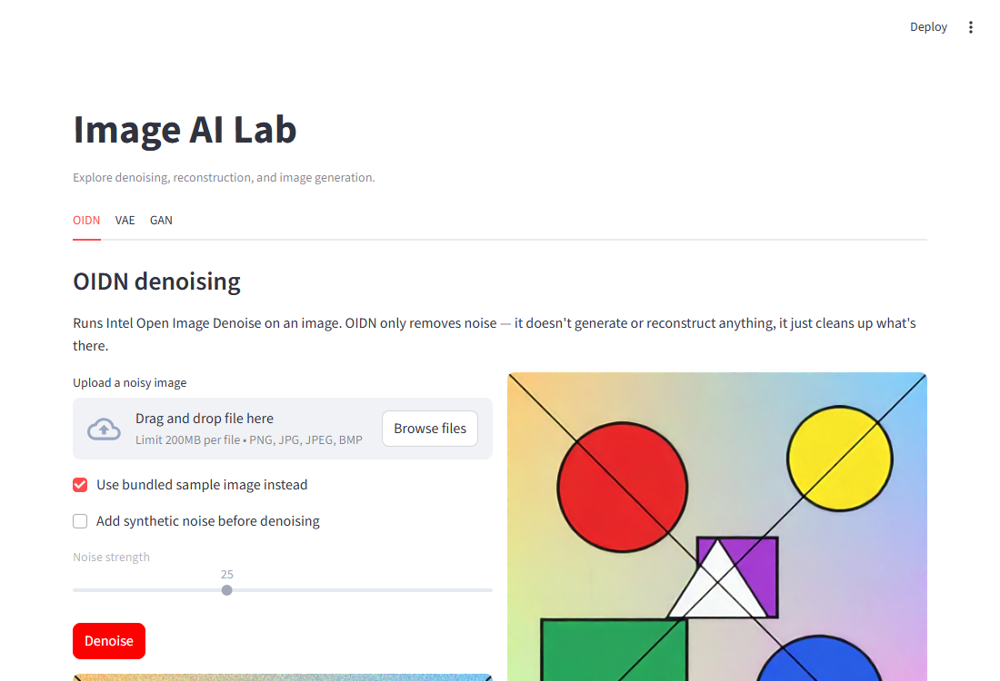
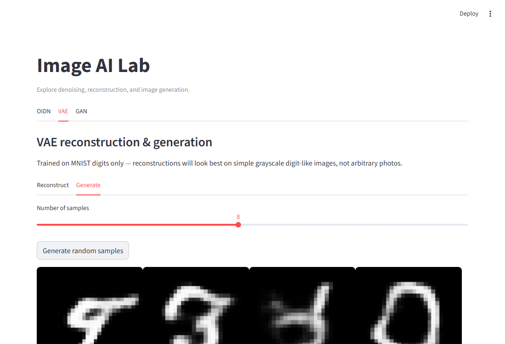
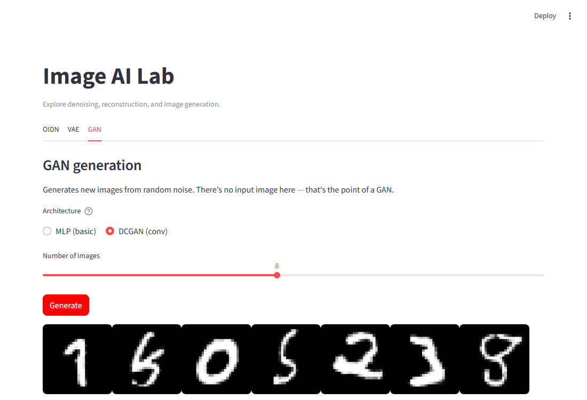
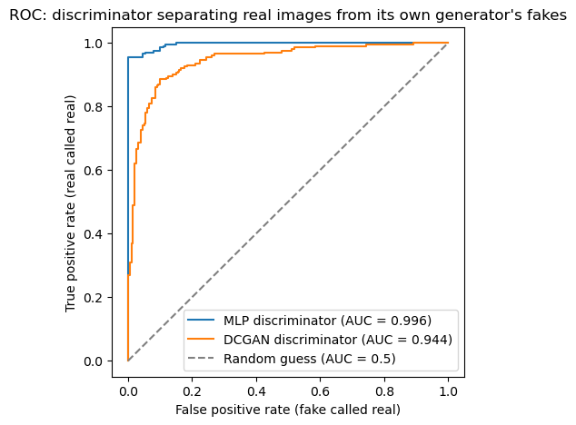

# PIXEL AI — Image Restoration & Generative AI Lab

**Author:** Udbhav Narawat

PIXEL AI implements and quantitatively evaluates three fundamentally
different approaches to "AI + images" — pretrained denoising (OIDN),
latent-space reconstruction/generation (VAE), and adversarial generation
(GAN, with a baseline-vs-improved comparison) — kept as independent modules
behind one Streamlit app, with every result backed by a real, reproducible
number rather than just a picture.

## Table of contents

- [For the evaluator](#for-the-evaluator)
- [Project overview](#project-overview)
- [Architecture](#architecture)
- [Project structure](#project-structure)
- [Installation](#installation)
- [Running the app](#running-the-app)
- [Training](#training)
- [Experimental configuration](#experimental-configuration)
- [Results](#results)
- [Model comparison](#model-comparison)
- [Conclusion](#conclusion)
- [Future experiments](#future-experiments)
- [References](#references)
- [Limitations](#limitations)

## For the evaluator

Fastest way to check this without installing anything: scroll to **Results**
below — every module's actual output is embedded there directly, including
a GAN vs. DCGAN comparison showing a real debugging/improvement process, not
just a single result.

The checkpoints in this repo were retrained on a Kaggle GPU (see `kaggle/`)
with substantially more epochs plus two additional stabilizers (DCGAN-paper
weight init and TTUR) layered on top of the earlier CPU-trained/debugged
version — the Experimental configuration and Results sections below reflect
that GPU run.

To run it live instead:
```bash
pip install -r requirements.txt
streamlit run app/streamlit_app.py
```
All three tabs (OIDN / VAE / GAN) work immediately — every checkpoint is
already trained and committed to this repo, nothing needs to be trained
first.

## Project overview

- **OIDN** — takes a noisy image, removes the noise. Pretrained, no training
  involved on our end.
- **VAE** — learns to encode MNIST digits into a compact latent space and
  decode them back; can reconstruct a digit or generate a new one from a
  random point in that latent space.
- **GAN** — learns to generate new MNIST digits from random noise, by
  training a generator against a discriminator.

These solve genuinely different problems and shouldn't be confused for one
another: OIDN restores an existing image, the VAE gives you a structured
latent space plus reconstruction/generation, and the GAN only generates from
noise with no input image at all.

## Architecture

**OIDN:**
```
Noisy Image → OIDN → Clean Image
```

**VAE:**
```
Image → Encoder → (mu, logvar) → Reparameterize → z → Decoder → Reconstruction
```

**GAN:**
```
Noise → Generator → Fake Image
                        ↑
        Discriminator ←-┘  (also sees real images)
```

## Project structure

```
PIXEL-AI/
├── app/streamlit_app.py     Streamlit frontend, ties all three modules together
├── oidn/                    OIDN inference (pretrained, no training script)
├── vae/                     VAE model, dataset, train, inference
├── gan/                     GAN model, dataset, train, inference
├── notebooks/                01_OIDN.ipynb, 02_VAE.ipynb, 03_GAN.ipynb, eval_utils.py (shared evaluation classifier)
├── models/                   saved checkpoints (oidn/ has none — see its README; eval_classifier.pt is evaluation-only, not a project module)
├── results/                   saved plots and sample images from training
└── data/                       downloaded datasets (MNIST etc., gitignored)
```

Each module folder (`oidn/`, `vae/`, `gan/`) has its own README with the
concepts, architecture, and commands specific to that module.

## Installation

```bash
python -m venv .venv
```

Windows:
```bash
.venv\Scripts\activate
```

Then:
```bash
pip install -r requirements.txt
```

## Running the app

```bash
streamlit run app/streamlit_app.py
```

The OIDN tab works immediately (no training needed). The VAE and GAN tabs
need a trained checkpoint first — see Training below. If a checkpoint is
missing, the app tells you so rather than training silently in the
background.

**Screenshots:**





## Training

```bash
python vae/train.py --epochs 15
python gan/train.py --epochs 30                        # MLP GAN (basic)
python gan/train.py --architecture dcgan --epochs 25    # DCGAN (conv, sharper/more varied — see gan/README.md)
```

Both scripts run on CPU or GPU automatically (`cuda` if available, else
`cpu`) and expose `--epochs`, `--batch-size`, `--lr`, and `--latent-dim`,
among other flags — see each module's README for the full list. A quick
smoke test (`--epochs 1 --max-batches 5`) is useful for checking everything
runs before committing to a full training run.

For a longer, GPU-backed training run with the extra stabilizers used for
the checkpoints in this repo (weight init, TTUR via `--lr-d`, more epochs),
see `kaggle/` — a self-contained notebook to run on a free Kaggle GPU.

## Experimental configuration

Exact defaults from each script's `argparse` setup (not placeholders), and
what the checkpoints actually committed to this repo were trained with —
they don't always match `--help`'s defaults, since these checkpoints came
from a deliberately tuned Kaggle GPU run (see `kaggle/`), on top of the
CPU-based debugging process documented in `gan/README.md`.

| | VAE | GAN — MLP | GAN — DCGAN |
|---|---|---|---|
| Dataset | MNIST | MNIST | MNIST |
| Default epochs | 15 | 30 | 30 |
| Epochs actually trained | 50 | 150 | 150 |
| Batch size | 128 | 64 | 64 |
| Generator learning rate | 1e-3 | 2e-4 | 2e-4 |
| Discriminator learning rate | — | 1e-4 (TTUR — slower than the generator, see `gan/README.md`) | 1e-4 (TTUR) |
| Optimizer | Adam | Adam (betas 0.5, 0.999) | Adam (betas 0.5, 0.999) |
| Latent dimension | 32 (default 20) | 100 | 100 |
| Label smoothing | — | 0.9 (real-label target) | 0.9 (real-label target) |
| Weight init | PyTorch default | DCGAN-paper `N(0, 0.02)` | DCGAN-paper `N(0, 0.02)` |
| Generator parameters | — | 1,510,032 | 766,017 |
| Discriminator parameters | — | 533,505 | 138,817 |
| VAE parameters | 341,825 | — | — |
| Trained on | Kaggle GPU (T4) | Kaggle GPU (T4) | Kaggle GPU (T4) |

Worth noting: the DCGAN generator has *fewer* parameters than the MLP
generator (766K vs. 1.51M) and still produces clearer, more diverse samples
(see Results) — the improvement came from a better-suited architecture, not
from throwing more capacity at the problem. The `kaggle/` notebook and
`gan/train.py --help` document every flag if you want to reproduce or
tweak this run.

## Results

All images below are produced by actually running the project's notebooks
(`notebooks/01_OIDN.ipynb`, `02_VAE.ipynb`, `03_GAN.ipynb`) against the real
trained checkpoints — not hand-picked or externally generated images.
Re-running any notebook regenerates the exact same files.

### OIDN

Noisy input vs. OIDN's denoised output:


**Quantitative result** — measured against a known clean reference image:


| | MSE (lower is better) | PSNR (higher is better) |
|---|---|---|
| Noisy vs. clean | 563.6 | 20.62 dB |
| Denoised vs. clean | 127.7 | 27.07 dB |

**PSNR improvement: +6.45 dB.**

### VAE

Top row: real test digits. Bottom row: the trained VAE's reconstruction of
each one.


Random samples decoded from points sampled directly from the latent space
(no input image at all):


**Quantitative result** — a separate small digit classifier (trained only for
this evaluation, not part of the VAE) checks whether it can still recognize
the correct digit after an image has been fully compressed through the VAE's
encoder and decoded back:


| | Classifier accuracy |
|---|---|
| Original test images | 97.6% |
| VAE reconstructions | 95.0% |

Digit identity survives the full encode/decode round-trip with only a small
drop. (This number moves a point or two between runs — the VAE's
reparameterization step samples fresh random noise every forward pass, so
reconstructions are genuinely stochastic, not cached. This is from the
50-epoch, latent-dim-32 GPU-trained checkpoint — a bit better than the
93.2-95.2% seen from the earlier 15-epoch/latent-dim-20 CPU-trained one.)

*(training loss curve: `results/vae/loss_curve.png`)*

### GAN — MLP (basic) vs. DCGAN (conv), same 150-epoch training budget (Kaggle GPU)


*(top: MLP — speckled, mode-collapsed. bottom: DCGAN — smoother, more variety.)*

**Quantitative result** — same classifier as above, run on 200 freshly
generated samples from each model, checking what digit (if any) it confidently
recognizes:


| | Avg. classifier confidence | Digit classes seen (out of 10) |
|---|---|---|
| MLP (basic) | 73.8% | 7/10 |
| DCGAN (conv) | 82.3% | 10/10 |

With the added weight init + TTUR + 150 epochs on GPU, the MLP GAN improved
over its earlier CPU-trained self (was 66.7% confidence, 6/10 classes) —
but it still never produces anything the classifier recognizes as a 0, 5,
or 6, direct numeric evidence that mode collapse is reduced, not eliminated.
The DCGAN still covers all 10 digits with higher confidence.

**ROC curve** — the discriminator's actual job is a binary classifier (real
vs. fake), so this is a direct fit, not a stretch: real MNIST test images
labeled 1, this generator's own freshly-generated fakes labeled 0, sweeping
every threshold on the discriminator's output score.



| | Discriminator AUC |
|---|---|
| MLP (basic) | 0.982 |
| DCGAN (conv) | 0.981 |

Read this one the other way round from the table above: **closer to 1.0 is
worse for the generator here.** With the earlier CPU-trained/under-tuned
MLP, this gap was large (0.996 vs. 0.944) — its discriminator could almost
perfectly spot the fakes. With proper weight init, TTUR, and more epochs,
the MLP closed almost all of that gap (0.982 vs. 0.981 — essentially tied).
So on this specific measure, better *training* mostly caught the MLP up to
the DCGAN. But the class-distribution result above tells a different part
of the story: the DCGAN still covers all 10 digits at higher confidence,
while the MLP still misses 3 of them — architecture still matters for
*diversity*, even once training itself is no longer the bottleneck.

See `gan/README.md` → Experiments & findings for the full story behind that
comparison (train longer → label smoothing → DCGAN), and
`results/gan/epoch_XXX*.png` for samples across training.

## Model comparison

| Model | Purpose                     | Input                  | Output                            | Quantitative result |
|-------|------------------------------|-------------------------|-------------------------------------|----------------------|
| OIDN  | Denoising                    | Noisy image             | Clean image                         | +6.45 dB PSNR vs. clean reference |
| VAE   | Reconstruction / generation  | Image / latent vector   | Reconstruction / generated image    | 95.0% digit identity preserved (vs. 97.6% baseline) |
| GAN   | Generation                   | Random noise            | Synthetic image                     | DCGAN: 10/10 digit classes, 82.3% confidence, discriminator AUC 0.981 (MLP: 7/10, 73.8%, AUC 0.982) |

## Conclusion

- **OIDN** measurably improves image quality with zero training on our end
  — +6.45 dB PSNR on the bundled test image, confirming the pretrained
  filter does real work rather than just looking different.
- **The VAE** compresses a digit down to 32 numbers and decodes it back
  while preserving its identity almost entirely — a classifier that's 97.6%
  accurate on originals is still 95.0% accurate on reconstructions. The
  cost of that compression is blurriness, a known, expected property of
  the pixel-wise reconstruction loss, not a bug.
- **The basic GAN**, under-tuned on CPU, revealed real mode collapse (6/10
  digit classes, a near-perfect 0.996 discriminator AUC meaning its fakes
  were easy to spot). Training longer alone made it worse. Label smoothing
  fixed the training-stability symptom but not the underlying diversity
  problem.
- **Better training technique closed part of the gap.** Retrained on a
  Kaggle GPU with DCGAN-paper weight init, TTUR (a slower discriminator
  learning rate), and 150 epochs, the *same* MLP architecture improved to
  7/10 classes, 73.8% confidence, and a discriminator AUC of 0.982 — nearly
  identical to the DCGAN's 0.981. So training technique, not just
  architecture, was part of the original problem.
- **But architecture still mattered for diversity.** Even with the same
  improved training recipe applied to both, the DCGAN reached full 10/10
  class coverage at 82.3% confidence — the MLP, however well-tuned, still
  missed 3 of the 10 digits. Fewer parameters (766K vs. 1.51M) and
  convolutional layers outperformed a larger, fully-connected one on
  sample diversity specifically.
- The overall takeaway: **training technique (init, learning-rate balance,
  training length) and architecture are separate levers that fix different
  problems** — this project's numbers (accuracy, AUC, class coverage) show
  each one's effect in isolation rather than crediting "we used a GPU" or
  "we used DCGAN" for everything at once.

## Future experiments

- **Data augmentation with GAN samples** — train a small classifier on
  MNIST with vs. without GAN-generated samples mixed in, and compare
  accuracy. Not implemented here, just a natural next step given the GAN
  module already exists.
- **Pix2Pix** — image-to-image translation is a different (paired,
  conditional) setup from the unconditional GAN here. Interesting future
  direction, not part of this project.

## References

These are the exact resources provided for this assignment:

- [PyTorch-GAN — basic GAN implementation](https://github.com/eriklindernoren/PyTorch-GAN/blob/master/implementations/gan/gan.py) — primary reference for the GAN module (generator/discriminator architecture, training loop, loss).
- [GANs for Data Augmentation and Privacy (Coursera assignment)](https://github.com/y33-j3T/Coursera-Deep-Learning/blob/master/Apply%20Generative%20Adversarial%20Networks%20(GANs)/Week%201%20-%20GANs%20for%20Data%20Augmentation%20and%20Privacy/C3W1_Assignment.ipynb) — reference for the GAN/data-augmentation workflow.
- [VAE notebook (Coursera assignment)](https://github.com/y33-j3T/Coursera-Deep-Learning/blob/master/Build%20Better%20Generative%20Adversarial%20Networks%20(GANs)/Week%202%20-%20GAN%20Disadvantages%20and%20Bias/C2W2_VAE.ipynb) — primary reference for the VAE module (encoder/decoder, reparameterization, loss).
- [Pix2Pix (Coursera assignment)](https://github.com/y33-j3T/Coursera-Deep-Learning/blob/master/Apply%20Generative%20Adversarial%20Networks%20(GANs)/Week%202%20-%20Image-to-Image%20Translation%20with%20Pix2Pix/C3W2A_Assignment.ipynb) — reference only, not implemented (see Future experiments).

## Limitations

- The VAE and GAN are both trained on MNIST only — they work with 28x28
  grayscale digits, not arbitrary photos. The Streamlit UI makes this clear
  rather than pretending otherwise.
- Both are deliberately simple architectures (a small conv VAE, an MLP GAN)
  chosen for readability over state-of-the-art image quality.
- The basic (MLP) GAN still shows some mode collapse even after a properly
  tuned, longer GPU training run (weight init + TTUR + 150 epochs) — it
  covers 7/10 digit classes, up from 6/10 untuned, but still misses 3. The
  conv-based DCGAN (kept alongside the MLP version, selectable in the app's
  GAN tab) reaches full 10/10 coverage under the same training recipe. See
  `gan/README.md` → Experiments & findings for the full write-up.
- OIDN is tuned for ray-traced renders, not general photography — results
  on real-world noisy photos can be inconsistent.
